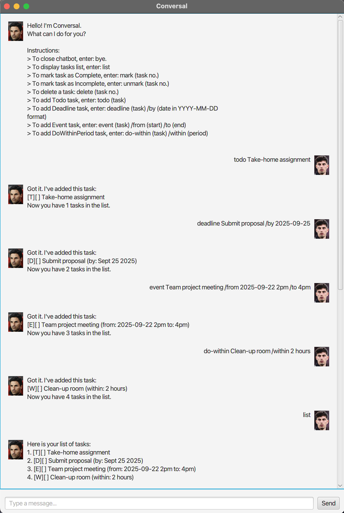

# Conversal User Guide



Conversal is a chatbot-style task manager.  

It helps you track tasks in four types: 
- **Todo**
- **Deadline**
- **Event**
- **DoWithinPeriod**

All data is saved locally in `data/tasks.txt` and persists between sessions.  
Commands are simple, text-based, and case-insensitive.


## Running Conversal

1. Make sure you have **Java 17** installed.  
   Run this command to check:
   ```bash
   java -version
   ```
   Output should say something like:
   ```
   openjdk version "17.x"
   ```

2. Download the latest JAR file from the **Releases** section of this repo.

3. Copy the JAR file into an empty folder.

4. Open a terminal/command prompt in that folder.

5. Run Conversal:
   ```bash
   java -jar conversal.jar
   ```

6. Start typing commands (e.g. `todo Homework`).


## Features

- Add Todo task
- Add Deadline task (`/by`)
- Add Event task (`/from ... /to ...`)
- Add Do-Within task (`/within`)
- List all tasks
- Mark tasks as complete
- Mark tasks as incomplete
- Delete tasks
- Find tasks by keyword
- Exit the chatbot


## Feature 1: Adding Todo Task
Adding a simple task without any date or time.

Format:  
`todo (task)`

Example:  
`todo Fold laundry`

The task will appear in the list as `[T]` (Todo):
```
[T][ ] Fold laundry
```


## Feature 2: Adding Deadline Task
Adding a task with a due date.

Format:  
`deadline (task) /by (YYYY-MM-DD)`

Example:  
`deadline Return library book /by 2025-10-01`

The task will appear as `[D]` (Deadline) with the due date:
```
[D][ ] Return library book (by: 2025-10-01)
```


## Feature 3: Adding Event Task
Adding a task with a start and end time.

Format:  
`event (task) /from (start) /to (end)`

Example:  
`event Project meeting /from Mon 2pm /to 4pm`

The task will appear as `[E]` (Event):
```
[E][ ] Project meeting (from: Mon 2pm to: 4pm)
```


## Feature 4: Adding Do-Within-Period Task
Adding a task to be completed within a certain period.

Format:  
`do-within (task) /within (period)`

Example:  
`do-within Submit report /within 2 days`

The task will appear as `[W]` (Do-Within):
```
[W][ ] Submit report (within: 2 days)
```


## Feature 5: Mark Task as Complete
Marking a task as done.

Format:  
`mark (task number)`

Example:  
`mark 2`

The task changes to `[X]` (done):
```
1. [T][ ] Fold laundry  
2. [D][X] Return library book (by: 2025-10-01)
```


## Feature 6: Mark Task as Incomplete
Marking a completed task as not done.

Format:  
`unmark (task number)`

Example:  
`unmark 2`

The task changes back to `[ ]` (not done):
```
1. [T][ ] Fold laundry  
2. [D][ ] Return library book (by: 2025-10-01)
```


## Feature 7: Show Task List
Viewing all current tasks in your list.

Format:  
`list`

Expected output:
```
Here is your list of tasks:  
1. [T][ ] Fold laundry  
2. [D][ ] Return library book (by: 2025-10-01)  
3. [E][ ] Project meeting (from: Mon 2pm to: 4pm)
```
